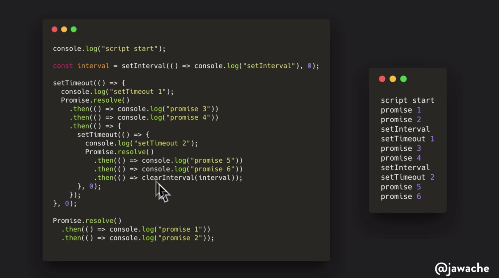

<h3 align="center">Async JavaScript Workshop</h3>

<div align="center">

[]()

</div>

---

<p align="center"> Async JavaScript Workshop, quizzes, demo, explanations, cheatsheets.
    <br> 
</p>

## 📝 Table of Contents

- [About](#about)
- [Getting Started](#getting_started)
- [Event Loops CheatSheet](#event_loops)

## 🧐 About <a name = "about"></a>

An in-depth tutorial on asynchronous JavaScript. From callbacks to promises (up to async/await pattern). Most advanced topic: iterators, generators, v8: node and chrome event loops.

Learning material from the Udemy Course of [Asim Hussain](https://www.udemy.com/asynchronous-javascript/).

## 🏁 Getting Started <a name = "getting_started"></a>

These instructions will get you a copy of the project up and running on your local machine for development and testing purposes.

### Prerequisites

In order to get the code up and running you need to have Node 10+ installed on your machine. VSCode is not necessary but it let's you run the selected node code pressing F8 with the "Node Exec" extension

## 🎈 Extract example <a name="usage"></a>

Different async patterns, from basic to advance, starting from the fs.readFile node method.

```js
const fs = require('fs');

const fileLoader = ['./files/demofile.txt', './files/demofile.other.txt'];
//Making a promise version of readFile
function readFile(filename, encoding) {
  return new Promise((resolve, reject) => {
    fs.readFile(filename, encoding, (err, data) => {
      if (err) reject(err);
      resolve(data);
    });
  });
}
```

### First implementation with standard Promises syntax

```js
// STEP 1: Making a promise all for files with standard promises
let promises = fileLoader.map(file => readFile(file, 'utf8'));
Promise.all(promises)
  .then(data => {
    console.log(data);
  })
  .catch(err => console.log(err));
```

### Second implementation using async await IIFE

```js
//STEP 2: Making a promise all for files with async await
(async () => {
  for (let file of fileLoader) {
    let value = await readFile(file, 'utf8');
    console.log(value);
  }
})();
```

### Third implementation using generators to iterate and resolve promises

```js
//STEP 3: Resolve promises using generators
function* fileGenerator(files) {
  for (let file of files) {
    yield Promise.resolve(readFile(file, 'utf8'));
  }
}

(async () => {
  for await (let x of fileGenerator(fileLoader)) {
    console.log(x);
  }
})();
```

## 🎈 Event loops CheatSheet <a name="event_loops"></a>

### This is a simplyfied version of the node event loop:


### An example code of the above schema:



### A simplyfied version of the v8 Chrome event loop:


